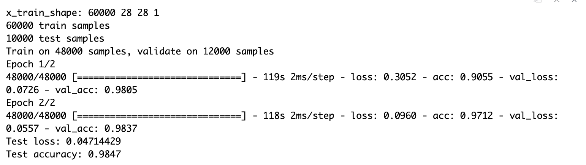

<!--
%\VignetteEngine{knitr::rmarkdown}
%\VignetteIndexEntry{The Homework 5 vignette}
-->

```{r setup, include=FALSE}
knitr::opts_chunk$set(echo = TRUE)
```

##1. Increase the out-of-sample prediction accuracy by extracting predictive features from the images with LASSO and CNN method.

Reference:
http://varianceexplained.org/r/digit-eda/
http://apapiu.github.io/2016-01-02-minst/
https://keras.rstudio.com/articles/examples/mnist_cnn.html
With help from Yuhan Xie

#load all the libraries
```{r, eval=FALSE}
rm(list = ls())
library(tidyverse)
library(glmnet)
library(tidyr)
library(ggplot2)
library(readr)
library(tensorflow)
library(moments)
library(keras)
```

```{r, eval=FALSE}
#install_keras()
#Since mnist is a list, name train dataset and test dataset for x and y from mnist
mnist <- dataset_mnist()
x_train <- mnist$train$x
y_train <- mnist$train$y
x_test <- mnist$test$x
y_test <- mnist$test$y
y_train <- factor(y_train)
y_test <- factor(y_test)

#Reshape the pixel matrix with the above dataset
x_train <- array_reshape(x_train, c(60000, 28^2))
x_test <- array_reshape(x_test, c(10000, 28^2))

#Prepare for CNN method
X_train <- mnist$train$x
X_valid <- mnist$test$x
Y_train <- mnist$train$y
Y_valid <- mnist$test$y
```

```{r, eval=FALSE}
#Train the model without extracted features
set.seed(1527)
s<- sample(seq_along(y_train), 1000)
fit <- cv.glmnet(x_train[s, ], y_train[s], family = "multinomial")

# in-sample test, accuracy on training dataset
preds.train1 <- predict(fit$glmnet.fit, x_train[s, ], s = fit$lambda.min, type = "class")
t1 <- table(as.vector(preds.train1), y_train[s])
sum(diag(t1)) / sum(t1) 

# out-of-sample test, accuracy on testing dataset
preds.test1 <- predict(fit$glmnet.fit, x_test, s = fit$lambda.min, type = "class")
t2 <- table(as.vector(preds.test1), y_test)
sum(diag(t2)) / sum(t2) 
```

Without intensity and kurtosis, when we identify the handwriting characters, the in-sample prediction accuracy on training dataset is 0.979, and the out-of-sample prediction accuracy on testing dataset is 0.8507.

In the following plot, we are going to compare means of intensiity, kurtosis and skeness among different digits in identifying handwrting characters and digits. 
```{r, eval=FALSE}
#From the plot, we can see the intensity means among digits are different, digit 2 has the lowest intensity, while digit 1 has the highest intensity
int_mean<-apply(x_train,1,mean)
label<-aggregate(int_mean,by=list(y_train),FUN = mean)
plot1<-ggplot(data =label,aes(x=Group.1,y=x))+geom_bar(stat = "identity")
plot1+scale_x_discrete(limits=0:9)+xlab("label")+ylab("intensity value")+ggtitle("comparison of intensity means")

#From the plot, we can see the value of kurtosis ranges from 4 to 7, and it's different among pixels
kurtosis<-apply(x_train,1,kurtosis)
klabel<-aggregate(kurtosis,by=list(y_train),FUN = kurtosis)
plot2<-ggplot(data = klabel,aes(x=Group.1,y=x))+geom_bar(stat = "identity")
plot2+scale_x_discrete(limits=0:9)+xlab("label")+ylab("kurtosis value")+ggtitle("comparison of kurtosis")

#From the plot, we can see the skewness are different among different digits 
skewness<-apply(x_train,1,skewness)
slabel<-aggregate(skewness,by=list(y_train),FUN = skewness)
plot3<-ggplot(data = slabel,aes(x=Group.1,y=x))+geom_bar(stat = "identity")
plot3+scale_x_discrete(limits=0:9)+xlab("digit label")+ylab("skewness")+ggtitle("comparison of skewness")
```
Since their means/values are very different among different digits and pixels, indicating that the above three features may be useful in identifying handwriting characters. In the following models, we are trying to include intensity and kurtosis and check the out-of-sample prediction accuracy.
```{r, eval=FALSE}
#Train the model with intensity
intensity<-as.vector(int_mean)
x_train<-cbind(x_train,intensity)
x_test<-cbind(x_test,as.vector(apply(x_test,1,mean)))

fit <- cv.glmnet(x_train[s,], y_train[s], family = "multinomial")
# in-sample test, accuracy on training dataset
preds.train2 <- predict(fit$glmnet.fit, x_train[s, ], s = fit$lambda.min, type = "class")
t3 <- table(as.vector(preds.train2), y_train[s])
sum(diag(t3)) / sum(t3) 

# out-of-sample test, accuracy on testing dataset
preds.test2 <- predict(fit$glmnet.fit, x_test, s = fit$lambda.min, type = "class")
t4 <- table(as.vector(preds.test2), y_test)
sum(diag(t4)) / sum(t4) 
```
With only intensity, the in-sample prediction accuracy on training dataset is 0.978, and the out-of-sample prediction accuracy on test dataset is 0.8515. The out-of-sample prediction accuracy is slightly better than the original model.
```{r, eval=FALSE}
#Adding kurtosis to the model 
kurtosis<-as.vector(kurtosis)
x_train<-cbind(x_train,kurtosis)
x_test<-cbind(x_test,as.vector(apply(x_test,1,kurtosis)))
#With intensity and kurtosis in the features
fit <- cv.glmnet(x_train[s,], y_train[s], family = "multinomial")
preds.train3 <- predict(fit$glmnet.fit, x_train[s, ], s = fit$lambda.min, type = "class")
t5 <- table(as.vector(preds.train3), y_train[s])
sum(diag(t5)) / sum(t5)

# out-of-sample test, accuracy on testing dataset
preds.test3 <- predict(fit$glmnet.fit, x_test, s = fit$lambda.min, type = "class")
t6 <- table(as.vector(preds.test3), y_test)
sum(diag(t6)) / sum(t6) ## prediction accuracy on testing dataset, 0.8528
```

Without intensity and kurtosis, the in-sample prediction accuracy on training dataset is 0.979, and the out-of-sample prediction accuracy on testing dataset is 0.8507. With only intensity, the in-sample prediction accuracy on training dataset is 0.978, and the out-of-sample prediction accuracy on test dataset is 0.8515. With both intensity and kurtosis, the in-sample prediction accuracy on training dataset is 0.982, and the out-of-sample prediction accuracy on test dataset is 0.8528. We can tell that the out-of-sample prediction accuracy continues increasing while we add more features to the model. As we can tell in the study, the in-sample accuracy on training dataset is much better than out-of-sample accuracy on testing dataset, so the overfitting problem may occur here.

In order to further improve the ou-of-sample prediction accuracy, we need to utilize machine learning techniques, while CNN plays an important role in identifying handwrting digits, characters and images, therefore, here, CNN method is utilized.

Since I set Epoch = 2, R need to train 480,000 samples twice. Becasue of the limitation in my CPU, it crashed several times on my computer. In case of such problems, I also attached the result photo here.

```{r, eval=FALSE}
# Define parameters
batch_size <- 128
num_classes <- 10
epochs <- 2

#Input image dimensions
img_rows <- 28
img_cols <- 28

# Split between train and test sets
mnist <- dataset_mnist()
x_train <- mnist$train$x
y_train <- mnist$train$y
x_test <- mnist$test$x
y_test <- mnist$test$y

# Redefine  dimension of train/test inputs
x_train <- array_reshape(x_train, c(nrow(x_train), img_rows, img_cols, 1))
x_test <- array_reshape(x_test, c(nrow(x_test), img_rows, img_cols, 1))
input_shape <- c(img_rows, img_cols, 1)

# Transform RGB values into [0,1] range
x_train <- x_train / 255
x_test <- x_test / 255
cat('x_train_shape:', dim(x_train), '\n')
cat(nrow(x_train), 'train samples\n')
cat(nrow(x_test), 'test samples\n')

# Convert class vectors to binary class matrices
y_train <- to_categorical(y_train, num_classes)
y_test <- to_categorical(y_test, num_classes)


# Define model
model <- keras_model_sequential() %>%
  layer_conv_2d(filters = 32, kernel_size = c(3,3), activation = 'relu',
                input_shape = input_shape) %>% 
  layer_conv_2d(filters = 64, kernel_size = c(3,3), activation = 'relu') %>% 
  layer_max_pooling_2d(pool_size = c(2, 2)) %>% 
  layer_dropout(rate = 0.25) %>% 
  layer_flatten() %>% 
  layer_dense(units = 128, activation = 'relu') %>% 
  layer_dropout(rate = 0.5) %>% 
  layer_dense(units = num_classes, activation = 'softmax')

# Compile model
model %>% compile(
  loss = loss_categorical_crossentropy,
  optimizer = optimizer_adadelta(),
  metrics = c('accuracy')
)

# Train model
model %>% fit(
  x_train, y_train,
  batch_size = batch_size,
  epochs = epochs,
  validation_split = 0.2
)
scores <- model %>% evaluate(
  x_test, y_test, verbose = 0
)

# The final result
cat('Test loss:', scores[[1]], '\n')
cat('Test accuracy:', scores[[2]], '\n')
```

From the output above, the out-of-sample prediction accuracy is over 98%, greatly larger than 85%, indicating that the out-of-sample prediction increases in the CNN method. It represents that CNN plays a better role in identifying handwriting characters than LASSO.

I intened to show the CNN result with cnn result.png, but it gave me an warning and turned out to be an error in Travis, therefore, I attached the pics in Vignette folder, please help yourself to checking. Thank you!
```{r}
#
```


#2. CASL 8.11.4
I downloaded the emnist dataset from https://www.westernsydney.edu.au/bens/home/reproducible_research/emnist
Preparing for further evaluation, I split the dataset into training and testing dataset, where the traning datset contains 88,799 observations and the testing dataset contains 14,799 observations.

In order to figure out the most suitable kernel size, I tried size = (2,2); (3,3); (5,5); (6,6) and found the test accuracy for them are 0.6841003, 0.6623017, 0.702615 and 0.6711203 respectively. Therefore, a kernel size = (5,5) should be utilized in the following calculation.

I first tried 10 epochs and found that the valid accuracy would first increase and achieves its highest point at ephochs = approximately 2 or 3, and then the accuracy starts decreasing. (Shown in the graph: epoch change value.jpeg). Therefore, using epoch = 10 is not a good idea in this problem when calculating the accuracy.

Considering using 10 epoches in the iteration is a waste of time, I designed early stop point in the model training process. If the accuracy value decreases consecutively twice, the training will be automatically stopped, and the highest epoch will be produced.

```{r,eval=FALSE}
#load data
#load('/Users/tianyuanzhang/desktop/emnist_test.rda')
#load('/Users/tianyuanzhang/desktop/emnist_train.rda')

#define the training and testing dataset
x_train <-as.matrix(emnist_train[,-1])
x_test <-as.matrix(emnist_test[,-1])
y_train<-emnist_train[,1]
y_test<-emnist_test[,1]
x_train <- array_reshape(x_train, c(nrow(x_train), 28, 28, 1))
x_test <- array_reshape(x_test, c(nrow(x_test), 28, 28, 1))

# Transform RGB values into [0,1] range
x_train <- x_train/255
x_test <- x_test/255

cat('x_train_shape:', dim(x_train), '\n')
cat(nrow(x_train), 'train samples\n')
cat(nrow(x_test), 'test samples\n')

# Convert class vectors to binary class matrices
y_train <- to_categorical(as.matrix(y_train-1), num_classes = 26)
y_test <- to_categorical(as.matrix(y_test-1), num_classes = 26)
# Define Model 
model <- keras_model_sequential()
model %>%
  layer_conv_2d(filters = 32, kernel_size = c(5,5),
                input_shape = c(28, 28, 1),
                padding = "same") %>%
  layer_activation(activation = "relu") %>%
  layer_conv_2d(filters = 32, kernel_size = c(5,5),
                padding = "same") %>%
  layer_activation(activation = "relu") %>%
  layer_max_pooling_2d(pool_size = c(2, 2)) %>%
  layer_dropout(rate = 0.5) %>%
  layer_conv_2d(filters = 32, kernel_size = c(5,5),
                padding = "same") %>%
  layer_activation(activation = "relu") %>%
  layer_conv_2d(filters = 32, kernel_size = c(5,5),
                padding = "same") %>%
  layer_activation(activation = "relu") %>%
  layer_max_pooling_2d(pool_size = c(5,5)) %>%
  layer_dropout(rate = 0.25) %>%
  layer_flatten() %>%
  layer_dense(units = 128) %>%
  layer_activation(activation = "relu") %>%
  layer_dense(units = 128) %>%
  layer_activation(activation = "relu") %>%
  layer_dropout(rate = 0.25) %>%
  layer_dense(units = 26) %>%
  layer_activation(activation = "softmax")
summary(model)

# Compile model
model %>% compile(loss = 'categorical_crossentropy',
                  optimizer = optimizer_rmsprop(),
                  metrics = c('accuracy'))
# Train model with an early stop
model %>% fit(
  x_train, y_train,
  validation_data = list(x_test,y_test),
  epochs = 15,
  callbacks=list(callback_early_stopping(patience=2, monitor='val_acc'))
)
predict.train <- predict_classes(model, x_train)
predict.test <- predict_classes(model, x_test)

# Output metrics
cat('Train:', predict.train==(emnist_train[,1]-1), '\n')
cat('Test:', predict.test==(emnist_test[,1]-1), '\n')
```

Our iteration stops at ephoch = 5, and the highest valid accuracy is 0.9182 and occurs at epoch = 3. The overall valid accuracy is 0.9057 and occurs at epoch = 5. The prediction accuracy in the text book are 0.9166667 (training) and 0.9039263 (testing).The  accuracy is very similar to our textbook. I also noticed that training accuracy is lower than the valid accuracy. To my understanding, one of the potential reason is we have high drop out rate as 0.5. High drop out rate may influence our final result. In the future work, I will try different combinations with drop out rate. (shown in the graph: 2plot.jpeg; 2result.jpeg)


#CASL 8.11.8

According to CASL textbook, we have learnt:
```{r}
# casl_nn_init_weights API
# Initiate weight matrics for a dense neural network.
#
# Args:
#     layer_sizes: A vector(numeric) showing the size of each layer
#
# Returns:
#     A list containing initialized weights and biases.
casl_nn_init_weights <- function(layer_sizes){
  len<- length(layer_sizes) - 1
  weights <- vector("list", len)
  
  for (i in seq_len(len)){
    w <- matrix(rnorm(layer_sizes[i] * layer_sizes[i + 1]),
            ncol = layer_sizes[i],
            nrow = layer_sizes[i + 1])
    weights[[i]] <- list(w=w,
                     b=rnorm(layer_sizes[i + 1]))
  }
  weights
}
weight <- casl_nn_init_weights(c(1, 25, 1))
```

```{r}
# casl_util_ReLU API
# Apply a rectified linear unit (ReLU) to a vector / matrix.
#
# Args:
#     vec: A vector(numeric) or matrix(numeric).
#
# Returns:
#     The original input with negative values truncated to 0.
casl_util_ReLU <- function(vec){
  vec[vec < 0] <- 0
  vec 
}
```

```{r}
# casl_util_ReLU_derivative API
# Apply derivative of the rectified linear unit (ReLU).
#
# Args:
#     vec: A vector(numeric) or matrix(numeric).
#
# Returns:
#     Returned with positive values to 1 and negative values to 0.
casl_util_ReLU_derivative <- function(vec){
  res <- vec * 0
  res[vec > 0] <- 1
  res
}
```

```{r}
# casl_util_mad_p API
# Derivative of the mean absolute deviance (MAD).
#
# Args:
#     y: A vector(numeric) of responses.
#     pred: A vector(numeric) of predicted responses.
#
# Returns:
#     Returned current derivative MAD
casl_util_mad_p <- function(y, pred){
  dev <- c()
  for(i in seq_along(pred)){
    if(pred[i] >= y[i]) dev[i] <- 1
    else dev[i] <- -1
  }
  dev
}
```

```{r}
# casl_nn_forward_prop API
# Apply forward propagation to a set of NN weights and biases.
#
# Args:
#     input: A vector(numeric) representing one row of the input.
#     weights: A list of weights built by casl_nn_init_weights.
#     sigma: The activation function.
#
# Returns:
#     A list containing the new weighted responses (z) and
#     activations (a).
casl_nn_forward_prop <- function(input, weights, sigma){
  len <- length(weights)
  z <- vector("list", len)
  a <- vector("list", len)
  
  for (i in seq_len(len)){
    a_i1 <- if(i == 1) input else a[[i - 1]]
    z[[i]] <- weights[[i]]$w %*% a_i1 + weights[[i]]$b
    a[[i]] <- if (i != len) sigma(z[[i]]) else z[[i]]
  }
  list(z = z, a = a)
}
```

```{r}
# casl_nn_backward_prop API
# Apply backward propagation algorithm.
#
# Args:
#     input: A vector(numeric) representing one row of the input.
#     output: A vector(numeric) representing one row of the response.
#     weights: A list created by casl_nn_init_weights.
#     forwardpp_obj: Output of the function casl_nn_forward_prop.
#     sigma_p: Derivative of the activation function.
#     f_p: Derivative of the loss function.
#
# Returns:
#     A list containing the new weighted responses (z) and
#     activations (a).
casl_nn_backward_prop <- function(input, output, weights, forwardpp_obj, sigma_p, f_p){
  z <- forwardpp_obj$z
  a <- forwardpp_obj$a
  len <- length(weights)
  grad_z <- vector("list", len)
  grad_w <- vector("list", len)
  
  for (i in rev(seq_len(len))){
    if (i == len) {
      grad_z[[i]] <- f_p(output, a[[i]])
      }
    else {
      grad_z[[i]] <- (t(weights[[i + 1]]$w) %*% grad_z[[i + 1]]) * sigma_p(z[[i]])
      }
    a_j1 <- if(i == 1) input else a[[i - 1]]
    grad_w[[i]] <- grad_z[[i]] %*% t(a_j1)
    }
  list(grad_z = grad_z, grad_w = grad_w)
}
```

```{r}
# casl_nn_sgd_mad API
# Apply stochastic gradient descent (SGD) to estimate NN.
#
# Args:
#     X: A data(numeric) matrix.
#     y: A vector(numeric) of responses.
#     layers_sizes: A vector(numeric) showing the sizes of layers in NN.
#     epochs: Integer number of epochs to computer.
#     lr: Learning rate.
#     weights: Optional list of starting weights.
#
# Returns:
#     A list containing the trained weights for the network.
casl_nn_sgd_mad <- function(X, y, layer_sizes, epochs, lr, weights=NULL){
  if (is.null(weights)){
    weights <- casl_nn_init_weights(layer_sizes)
  }
  
  # for every individual, update the weights and repeat the procedure over all individuals.
  for (epoch in seq_len(epochs)){
    # propergations
    for (i in seq_len(nrow(X))){ 
      # excute forward propergation
      forwardpp_obj <- casl_nn_forward_prop(X[i,], weights, casl_util_ReLU)
      # excute backward propergation
      backwardpp_obj <- casl_nn_backward_prop(X[i,], y[i,], weights,
                                     forwardpp_obj, casl_util_ReLU_derivative, casl_util_mad_p)
      # update weights matrics
      for (j in seq_along(weights)){
        weights[[j]]$b <- weights[[j]]$b -lr * backwardpp_obj$grad_z[[j]]
        weights[[j]]$w <- weights[[j]]$w -lr * backwardpp_obj$grad_w[[j]]
      }
    }
  }
  weights
}
```


```{r}
# casl_nn_predict function
# Predict values from a training neural network.
#
# Args:
#     weights: List of weights describing the neural network.
#     X_test: A numeric data matrix for the predictions.
#
# Returns:
#     A matrix of predicted values.
casl_nn_predict <- function(weights, X_test){
  p <- length(weights[[length(weights)]]$b)
  y_hat <- matrix(0, ncol = p, nrow = nrow(X_test))
  
  # excute prediction by forward propergation
  for (i in seq_len(nrow(X_test))){
    a <- casl_nn_forward_prop(X_test[i,], weights, casl_util_ReLU)$a
    y_hat[i, ] <- a[[length(a)]]
    }
  y_hat
}
```


```{r}
library(tidyverse)
#Simulate data using MAD
X <- matrix(runif(1000, min = -1, max = 1), ncol = 1)
yn <- X[, 1, drop = FALSE]^2 + rnorm(1000, sd = 0.1)
# change some yn to be very large (outliers)
ind <- sample(seq_along(yn), 100)
yn[sort(ind)] <- c(runif(50, -10, -5), runif(50, 5, 10))

# train and update weights
weights <- casl_nn_sgd_mad(X, yn, layer_sizes = c(1, 25, 1), epochs = 15, lr = 0.01)
# predict with trained weights
y_pred <- casl_nn_predict(weights, X)
# visualiza the true value and predicted value
d <- tibble(x = as.vector(X), y_pred = as.vector(y_pred),
            y = X[, 1]^2, yn = as.vector(yn))

# plot  result with mean absolute deviation
ggplot(d) + 
  geom_point(aes(x = x, y = yn)) +
  geom_point(aes(x = x, y = y_pred, color = "pink", alpha = 1.5)) +
  labs(x = "x", y = "true/predicted", title = "True and Predicted Values with Mean Absolute Deviance (MAD)") +
  theme(legend.position="None") + labs(subtitle="Pink: Predicted; Black: True") +
  theme(plot.title = element_text(hjust = 0.5), plot.subtitle = element_text(hjust = 0.5))
```


From the plot, we can see that the predicted value almost overlap with the true points, indicating that with outliers, the predicted values are robust and they are not influenced by the outliers. The neural network and stochastic gradient descent algorithm have robustness to outliers when using mean assolute deviance(MAD).

casl_util_mse_derivative API
```{r, echo=FALSE}
# Derivative of the mean squared error (MSE) function.
#
# Args:
#     y: A numeric vector of responses.
#     pred: A numeric vector of predicted responses.
#
# Returns:
#     Returned current derivative the MSE function.
casl_util_mse_derivative <- function(y, pred){
  2 * (pred - y)
}
```

casl_nn_sgd_mse API
```{r, echo=FALSE}
# Apply stochastic gradient descent (SGD) to estimate NN.
#
# Args:
#     X: A numeric data matrix.
#     y: A numeric vector of responses.
#     sizes: A numeric vector giving the sizes of layers in
#            the neural network.
#     epochs: Integer number of epochs to computer.
#     lr: Learning rate.
#     weights: Optional list of starting weights.
#
# Returns:
#     A list containing the trained weights for the network.
casl_nn_sgd_mse <- function(X, y, layer_sizes, epochs, lr, weights=NULL){
  if (is.null(weights)){
    weights <- casl_nn_init_weights(layer_sizes)
  }
  ## for every individual, update the weights; repeat the procedure over all individuals.
  for (epoch in seq_len(epochs)){
    # propergations
    for (i in seq_len(nrow(X))){ 
      # forward propergations
      forwardpp_obj <- casl_nn_forward_prop(X[i,], weights, casl_util_ReLU)
      # backward propergations
      backwardpp_obj <- casl_nn_backward_prop(X[i,], y[i,], weights,
                                     forwardpp_obj, casl_util_ReLU_derivative, casl_util_mse_derivative)
      # update weights
      for (j in seq_along(weights)){
        weights[[j]]$b <- weights[[j]]$b -lr * backwardpp_obj$grad_z[[j]]
        weights[[j]]$w <- weights[[j]]$w -lr * backwardpp_obj$grad_w[[j]]
      }
    }
  }
  weights
}
```


```{r, echo=FALSE}
#Simulate data processing for MSE
X <- matrix(runif(1000, min = -1, max = 1), ncol = 1)
yn <- X[,1,drop = FALSE]^ 2 + rnorm(1000, sd = 0.1)
# change some yn to be very large (outliers)
ind <- sample(seq_along(yn), 100)
yn[sort(ind)] <- c(runif(50, -10, -5), runif(50, 5, 10))

# train and update weights
weights <- casl_nn_sgd_mse(X, yn, layer_sizes = c(1, 25, 1), epochs = 15, lr = 0.01)
# predict with trained weights
y_pred <- casl_nn_predict(weights, X)
# visualiza the true value and predicted value
d <- tibble(x = as.vector(X), y_pred = as.vector(y_pred),
            y = X[,1]^2, yn = as.vector(yn))

# plot results with mean square error
ggplot(d) + 
  geom_point(aes(x = x, y = yn)) +
  geom_point(aes(x = x, y = y_pred, color = "pink", alpha = 1.5)) +
  labs(x = "x", y = "true/predicted", title = "True and Predicted Values with Mean Squared Error (MSE)") +
  theme(legend.position="None") + labs(subtitle="Pink: Predicted; Black: True") +
  theme(plot.title = element_text(hjust = 0.5), plot.subtitle = element_text(hjust = 0.5))
```

If we use MSE instead of MAD, the SGD method is not as robust as before. According to the above plot, the predicted values are apart from/ above true values, indicating the predicted values are influenced by outliers. 